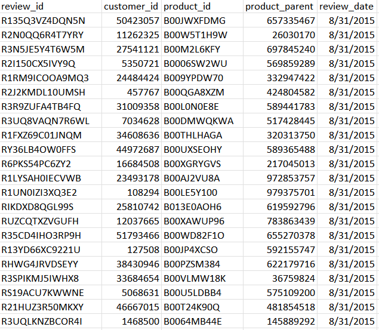
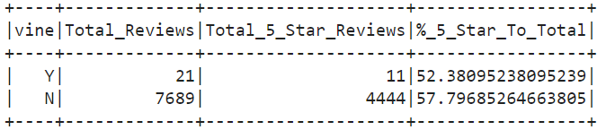

# Amazon_Vine_Analysis

## Objective
The goal of this challenge is to assess Amazon product reviews. Using AWS RDS instance, PySpark and pgAdmin we will analyze the product data and reviews, additionally assessing if being a Vine member influences customer reviews.  To achieve this we will complete the following deliverables:
- Perform ETL on Amazon Product Reviews
- Determine Bias of Vine Reviews

### Deliverable 1: Performing an ETL on Amazon Product Reviews
To complete this activity we will be achieving the following tasks:
- Create an AWS RDS database with tables in pgAdmin
- Pick a dataset from Amazon Reviews: **JEWELRY**
- Extract the dataset into a DataFrame
- Transform the DataFrame inot four separate DataFrames/Tables and publish the results

### Deliverable 1: Results

**CUSTOMER DATA TABLE**

*Data: customer_id, customer_count*

**PRODUCTS DATA TABLE **

*Data: product_id, product_title*

**REVIEW ID DATA TABLE**

*Data: review_id, customer_id, product_id, product_parent, review_date*

**VINE DATA TABLE**

*Data: review_id, star_rating, helpful_votes, total_votes, vine, verified_purchase*

### Deliverable 2: Determine Bias of Vine Reviews
To complete this activity, we will be utilizing the Vine table created under Deliverable 1 to determine if having a paid Vine review makes a difference in the percentage of 5-star reviews.

### Deliverable 2: Results

**VINE SUMMARY TABLE**

*Data: Vine(Y/N), Total_Reviews, Total_5_Star_Reviews, %_5_Star_to_Total*

Q1 - How many Vine reviews and non-Vine reviews were there?

A1 - There were 21 Vine reviews, and 7,689 non-Vine reviews (after filtering for a total_vote count that is equal to or greater than 20).

Q2 - How many Vine reviews were 5 stars? How many non-Vine reviews were 5 stars?

A2 - There were 11 Vine reviews that were 5 stars, and 4,444 non-Vine reviews that were 5 stars.

Q3 - What percentage of Vine reviews were 5 stars? What percentage of non-Vine reviews were 5 stars?

A3 - 52.4% of Vine reviews were 5 stars. 57.8% of non-Vine reviews were 5 stars.

In summary, there does not appear to be a correlation to achieving better reviews via Vine members, as both yielded a similar % of 5 star ratings, and the % of Vine reviews were in fact lower than the % of 5 star reviews given by non-Vine members.  To continue analyzing this data, we might also consider using the 4 Star reviews to see if there is any major transgression from the above results.

