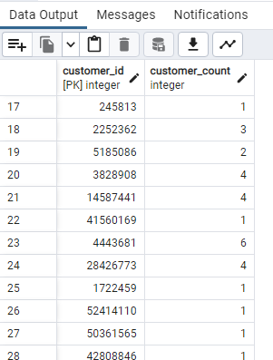
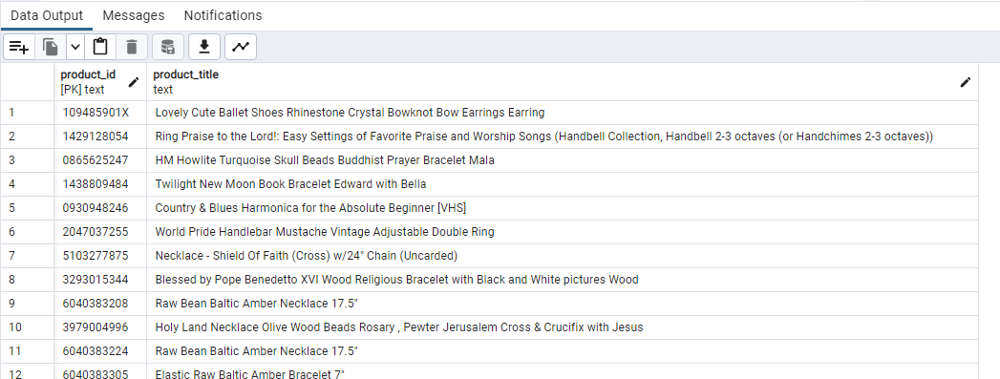
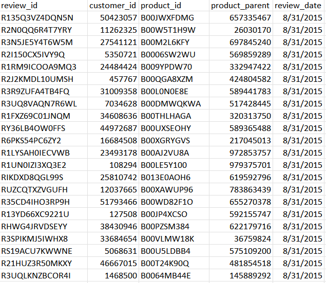
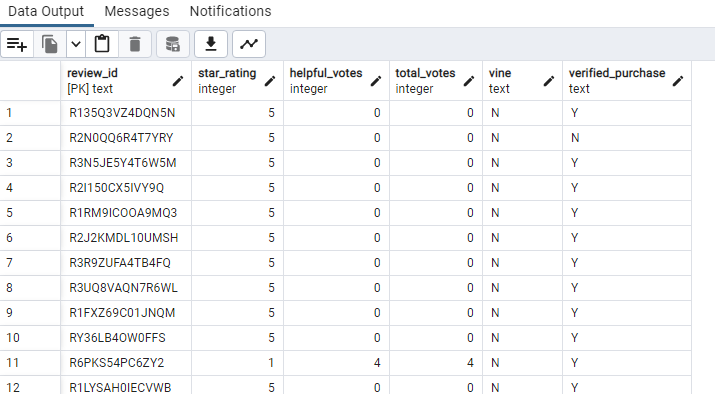

# Amazon_Vine_Analysis

## Objective
The goal of this challenge is to assess Amazon product reviews. Using AWS RDS instance, PySpark and PgAdmin we will analyze the product data and reviews, additionally assessing if being a Vine member influences customer reviews.  To achieve this we will complete the following deliverables:
-1. Perform ETL on Amazon Product Reviews
-2. Determine Bias of Vine Reviews

### Deliverable 1: Performing an ETL on Amazon Product Reviews
To complete this activity we will be achieving the following tasks:
-1. Create an AWS RDS database with tables in pgAdmin
-2. Pick a dataset from Amazon Reviews: **JEWELRY**
-3. Extract the dataset into a DataFrame
-4. Transform the DataFrame inot four separate DataFrames/Tables and publish the results

### Deliverable 1: Results

**Customer data table**
*Data: customer_id, customer_count*

**Products data table**
*Data: product_id, product_title*

**Review id data table**
*Data: review_id, customer_id, product_id, product_parent, review_date*

**Vine data table**
*Data: review_id, star_rating, helpful_votes, total_votes, vine, verified_purchase*

